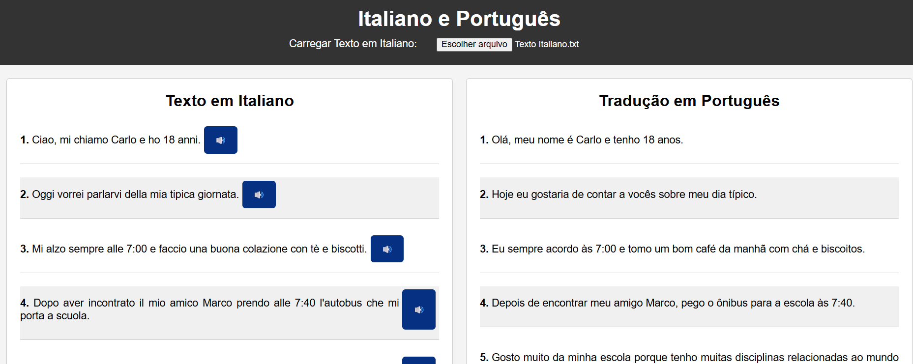
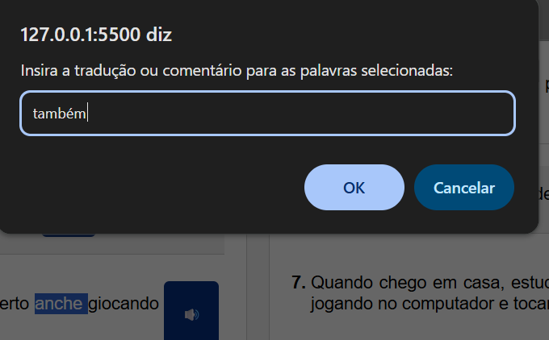
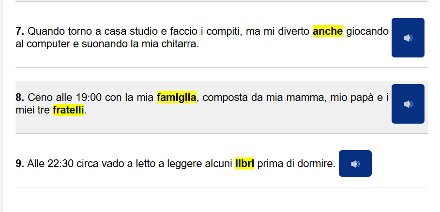
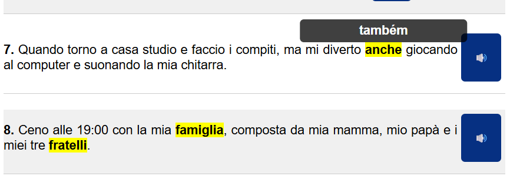
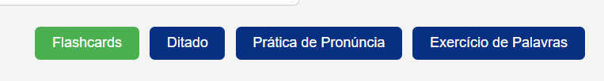
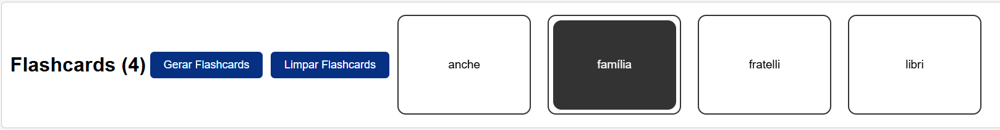

# 🌍 Estudo de Língua Estrangeira com Tradução, Áudio e Exercícios Interativos

Este projeto é uma ferramenta interativa para auxiliar no **estudo de línguas estrangeiras**. Criado com HTML, CSS e JavaScript, ele permite carregar textos, gerar traduções, ouvir áudios das frases e montar listas de vocabulário personalizado para exercícios como **flashcards** e **ditados**.

> ✅ Atualmente configurado para o **Italiano**, mas pode ser facilmente adaptado para qualquer idioma compatível com as APIs do Google Cloud.

---

## 🧠 Funcionalidades

- 📁 Carregamento de arquivos `.txt` com textos no idioma de estudo.
- 🧩 Divisão automática do texto em **frases ou parágrafos**.
- 🌐 Geração de **traduções automáticas** usando a API do Google Cloud Translation.
- 🔊 Geração de **áudio** para cada frase (via Google Cloud Text-to-Speech).
- 🖱️ Seleção de palavras ou expressões com **dois cliques**.
- 📝 Inclusão manual de tradução para cada palavra ou expressão selecionada.
- 🖍️ Destaque visual no texto das palavras marcadas, com **tooltip** de tradução ao passar o mouse.
- 🎯 Montagem automática de **listas de vocabulário** para exercícios interativos:
  - Flashcards (_reading_)
  - Ditado (_listening__
  - Prática de pronúncia (_speaking_)
  - Exercício de palavras (_writing_)

---

## ⚙️ Tecnologias Utilizadas

- HTML5
- CSS3
- JavaScript (ES6+)
- Google Cloud APIs:
  - Translation API
  - Text-to-Speech API

---

## 🛠️ Instruções de Uso

1. **Configure sua chave de API do Google Cloud:**
   - Acesse [Google Cloud Console](https://console.cloud.google.com/)
   - Ative as APIs: Translation e Text-to-Speech.
   - Gere uma **chave de API** e insira no arquivo `script.js` (8ª linha)

2. **Carregue um texto (.txt):**
   - O texto deve estar no idioma estrangeiro que você deseja estudar.
   - Clique no botão "Carregar Texto" e selecione seu arquivo `.txt`.

3. **Visualize e interaja com o conteúdo:**
   - O texto será dividido automaticamente em frases ou parágrafos, com botão de áudio disponível.
   - A tradução será exibida ao lado de cada trecho.
   - Para adicionar palavras ao vocabulário:
     - Dê **dois cliques** sobre a palavra ou expressão desejada.
     - Digite sua tradução manual.
     - A palavra/expressão será **destacada** e exibirá sua tradução ao passar o mouse.

4. **Acesse os exercícios:**
   - As palavras selecionadas ficarão disponíveis para os módulos de **exercícios interativos**.

---

## 🔧 Personalização

- Para alterar o **idioma de origem e destino**, modifique os parâmetros na chamada da API de tradução no código JavaScript (ex: `source=it`, `target=pt`).
- Você também pode ajustar o estilo visual via CSS ou adicionar mais modos de exercício ao projeto.

---

## 📌 Requisitos

- Navegador moderno (Chrome, Firefox, Edge)
- Conexão com a internet (para uso das APIs do Google)
- Chave de API válida no Google Cloud

---

## 📄 Licença

Este projeto é de código aberto sob a licença [MIT](LICENSE).

---

## 🤝 Contribuições

Sinta-se à vontade para abrir *issues*, propor *pull requests* ou sugerir melhorias!

---

## Imagens do Aplicativo

- Tela Inicial

- Destaque das palavras

- Exercícios

